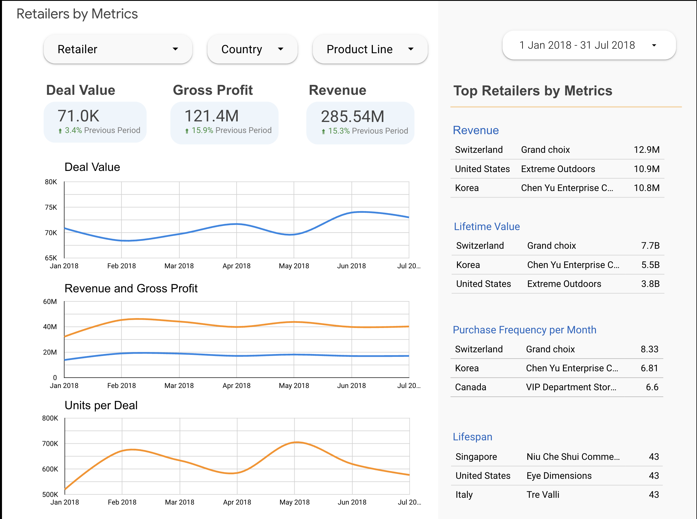
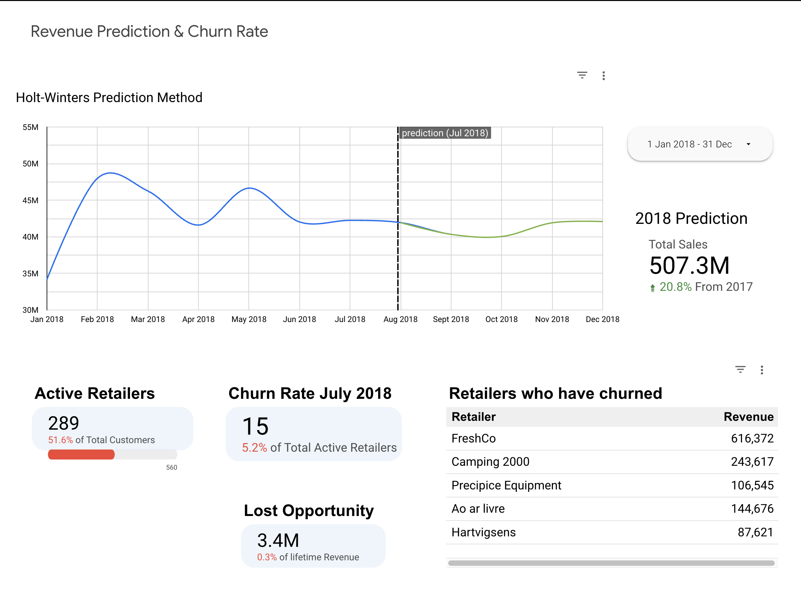
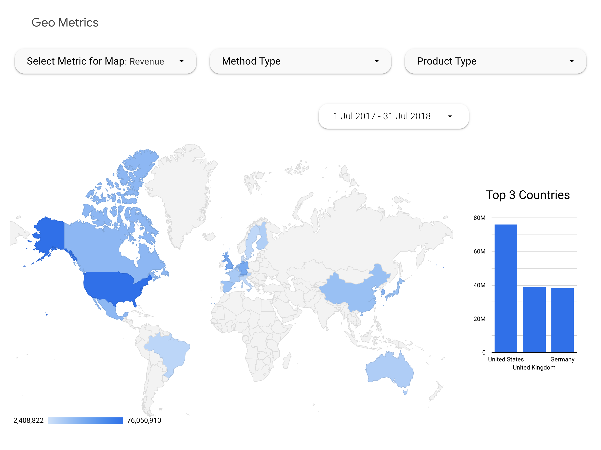

# 📊 Business KPI Dashboard (Looker + BigQuery + Python)

This project turns messy spreadsheets into **actionable business insights**. Using **Google BigQuery** for scalable storage, **Looker** for interactive dashboards, and a **Python forecasting model**, it delivers a complete end-to-end analytics solution.

From **revenue and profit tracking → customer behavior analysis → future sales prediction**, everything is standardized, automated, and designed to help teams make faster, data-driven decisions.

---

## 🔍 Dashboard Previews

### Main Business KPI Dashboard

*An overview of revenue, sales efficiency, customer metrics, and forecasts.*

### Revenue Prediction

*Visualizing future sales trends using the Holt-Winters model.*

### Geographical Performance 

*Revenue breakdown by country for deeper insights.*

---

## 🚀 Business Value

The goal of this project is simple: **turn data into decisions**.

- Standardized KPI definitions = no more “which revenue number is right?” debates.
- Clear visibility into **revenue, profit, customer behavior, and churn**.
- A forecasting model (Holt-Winters) to **predict future sales trends**.

---

## 📂 Repository Structure

- **dashboards/** → 📑 PDF exports of Looker dashboards.
- **bigquery_data_models/** → 🗂️ SQL queries for KPI prep & transformations.
- **raw_data/** → 📊 Original spreadsheets (the messy starting point).
- **predictive model/** → 🐍 Python notebook (Colab) for sales forecasting.

---

## 🔑 Key KPIs Tracked

- 💰 **Revenue & Gross Profit** – overall financial health
- 📦 **Deal Value & Units per Deal** – sales efficiency
- 📲 **Order Methods** – web vs. phone orders
- 🌍 **Geographical Performance** – breakdown by country
- 🔮 **Revenue Prediction & Churn Rate** – looking ahead
- 👥 **Customer Lifetime Value (CLTV)** – identifying VIPs
- ♻️ **Purchase Frequency & Lifespan** – engagement patterns

---

## 🔄 Data Flow

1. **Raw Data** → `Data.xlsx` (in `/raw_data/`)
2. **Storage** → uploaded & transformed in **BigQuery**
3. **Analytics** → Looker dashboards pulling from BigQuery tables + SQL models
4. **Prediction** → Python Holt-Winters forecasting model

---

## 📊 Dashboards

Main report: **Business KPI Dashboard**  
(Quick insights into revenue, customer behavior, and sales forecasts).

---

## 🐍 Predictive Model

The **Sales_prediction.ipynb** notebook (in `/prediction_model/`) implements a **Holt-Winters model** for sales forecasting.  

Outputs: revenue trends, growth projections, and churn indicators.

---

## ⚡ How to Explore

1. Open dashboards → `/dashboards/` folder.
2. Review SQL logic → `/bigquery_data_models/`.
3. Play with forecasting → `/prediction_model/`.

---

## 👥 Contributors

- Carlos Montefusco https://github.com/camontefusco
- Sahand Azizi https://github.com/Zehando
- Olaf Bulas https://github.com/Cebulva

---

## 📬 Contact

- GitHub: https://github.com/victoria-vasilieva/
- LinkedIn: https://www.linkedin.com/in/victoria-vasilieva/
- 📧 Email: v.vasiliewa@gmail.com

---

✨ **Clone, explore, and adapt** this project for your own business insights!
